# ☁️ Predicción de Lluvia en Bilbao con Machine Learning 🌧️

Proyecto académico para el módulo de Machine Learning — Clasificación binaria

**Objetivo**: Predecir si lloverá o no en Bilbao, a partir de variables meteorológicas históricas

---

## 🧠 ¿Qué aprenderás con este proyecto?

✔️ Cómo estructurar un proyecto de ML de principio a fin (End-to-End)  
✔️ Cómo hacer análisis exploratorio y visualizaciones efectivas  
✔️ Cómo preprocesar datos reales (nulos, variables categóricas, ingeniería de features)  
✔️ Cómo entrenar modelos de clasificación binaria  
✔️ Cómo interpretar métricas como F1-score, ROC-AUC, Matriz de confusión  
✔️ Cómo crear una predicción sobre un registro nuevo  

---

## 📁 Estructura del repositorio

```
Evaluacion-ml-climabilbao/
├── Pipfile
├── Pipfile.lock
├── README.md
├── __init__.py
├── data/
│   ├── bilbao_diario_2000_2024.csv
│   └── bilbao_horario_2000_2024.csv
├── notebooks/
│   ├── __init__.py
│   └── main.ipynb
└── src/
    ├── __init__.py
    ├── descargar_meteo_bilbao.py
    ├── eda.py
    ├── modeling.py
    ├── predict.py
    └── preprocessing.py
```
---

---

## 📊 Presentación visual del análisis exploratorio (EDA)


### 🧩 Slide — Distribución de la variable objetivo `rain`

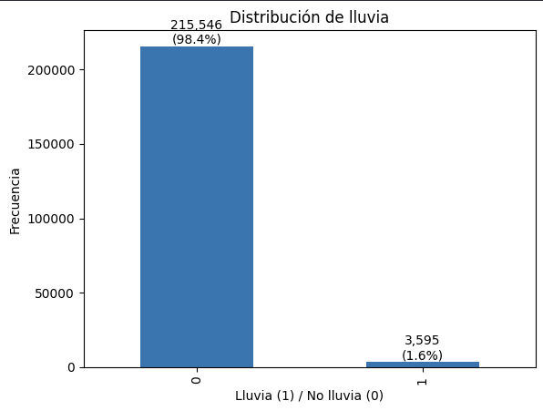

> El dataset original está fuertemente desbalanceado: solo el **1.6%** de las observaciones horarias presentan lluvia. Esta asimetría motivó la necesidad de balancear las clases antes del entrenamiento, para evitar que el modelo simplemente predijera "no llueve" siempre.

---

### 🧩 Distribución de variables meteorológicas


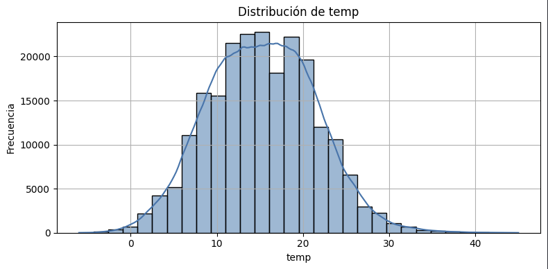

> La variable `temp` sigue una distribución normal centrada entre 15 y 20 °C, con valores extremos entre -5 y 45 °C.

---

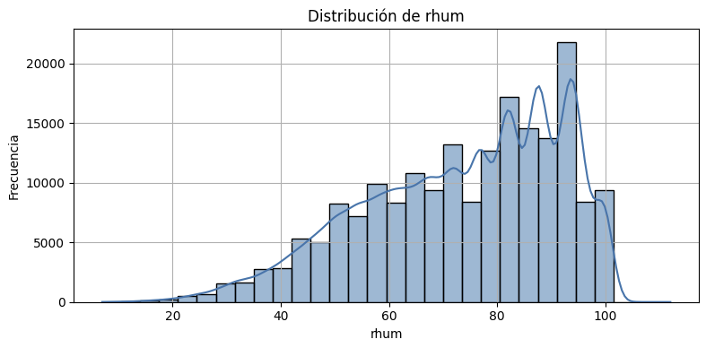

> `rhum` presenta una concentración alta entre el 70% y el 100%. La humedad elevada podría relacionarse con lluvia.

---

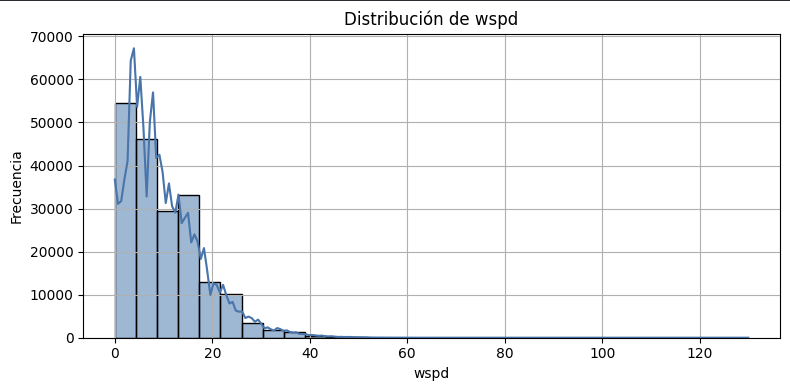

> La variable `wspd` está altamente sesgada a la derecha, con la mayoría de los valores entre 0 y 10 km/h.

---

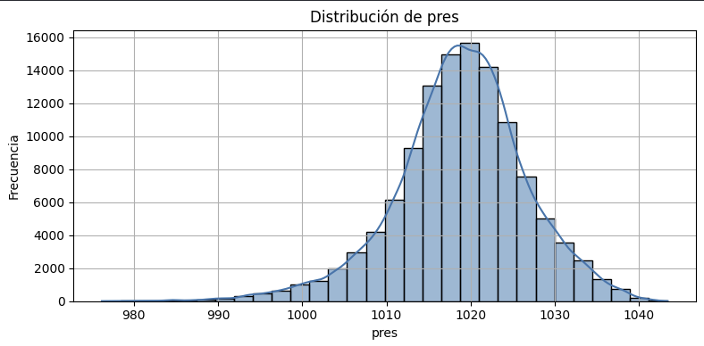

> `pres` muestra un comportamiento normal típico entre 1000 y 1030 hPa, como se espera en regiones atlánticas.

---

### 🧩 Boxplots según la clase `rain`

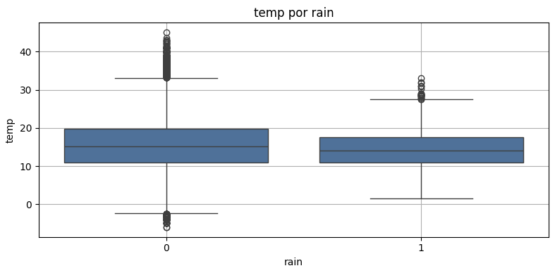

> Las temperaturas tienden a ser ligeramente más bajas en las horas con lluvia.

---

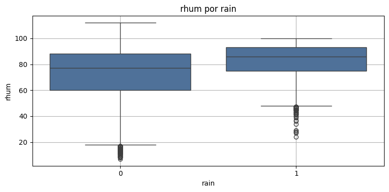

> La humedad es significativamente más alta cuando llueve, con menos valores extremos.

---

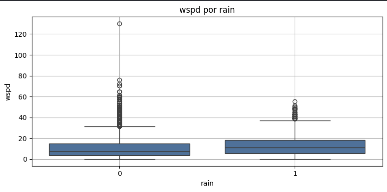

> En horas de lluvia hay una ligera tendencia a mayor viento, aunque con solapamiento entre clases.

---

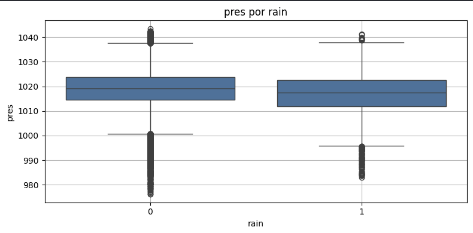

> La presión tiende a ser un poco más baja cuando llueve, pero la diferencia no es tan marcada como en `rhum`.

---

### 🧩 Matriz de correlaciones

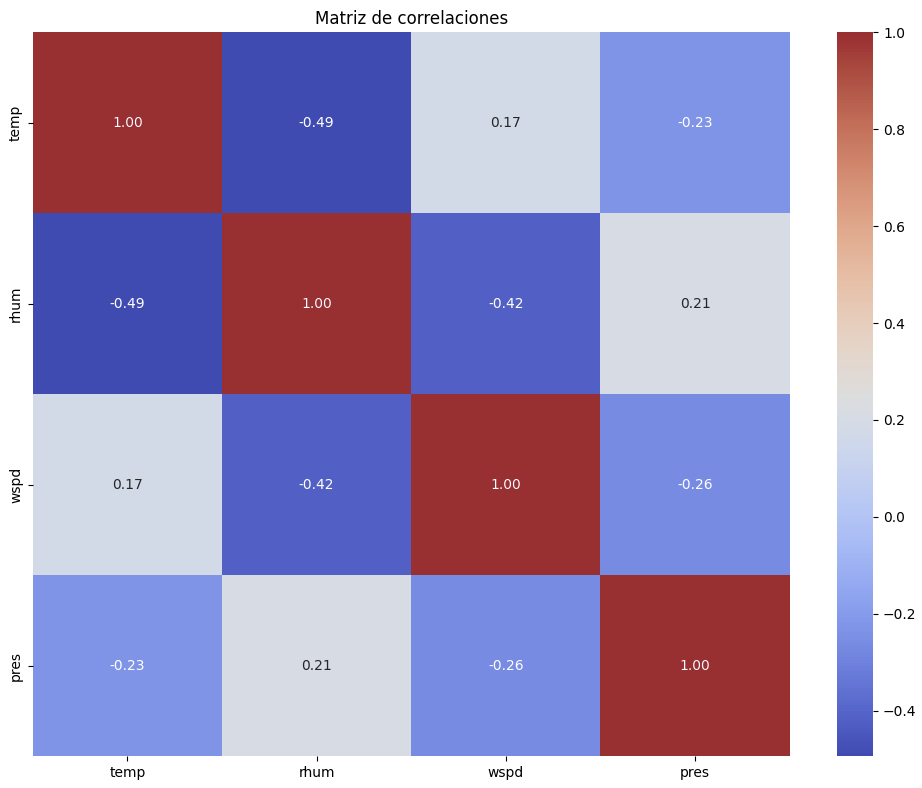

> Se observa una correlación negativa entre temperatura y humedad (`-0.49`), lo cual es coherente meteorológicamente.

---

### 🧩 Muestra de datos limpios


> Se muestra una vista previa de los primeros registros tras el preprocesamiento: sin nulos y con variables temporales extraídas (`hora`, `día`, `mes`, `año`).

---

## 📈 Evaluación y resultados del modelo

### 🧩 Slide — Balance de clases

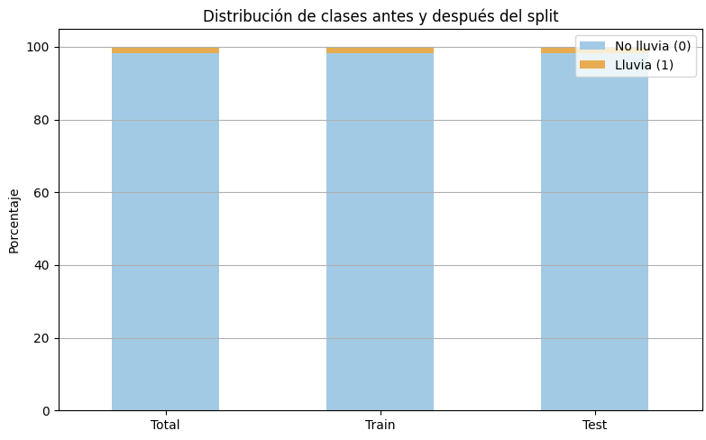

> Tras aplicar una división manual con `split_balanced()`, el dataset quedó equilibrado entre clases (`rain = 0` y `rain = 1`) tanto en entrenamiento como en test. Esto fue fundamental para evitar un sesgo hacia la clase mayoritaria.

---

### 🧩 Slide — Comparación de modelos

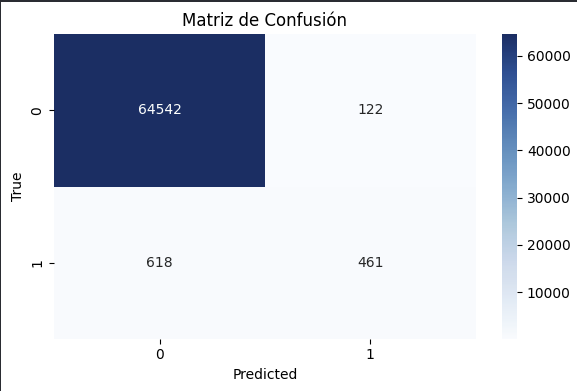

> Aunque ambos modelos presentan alta precisión general (`accuracy`), solo el modelo **Random Forest** logra un F1-score aceptable para la clase minoritaria (lluvia), lo que lo convierte en el mejor candidato para este caso.

---

### 🧩 Slide — Matriz de confusión (threshold por defecto)


> El modelo Random Forest detecta con éxito los casos sin lluvia, pero falla en muchos casos de lluvia (`FN = 618`). Esto indica que necesita mayor sensibilidad, lo cual motiva el ajuste del umbral de decisión.

---

### 🧩 Slide — Curva ROC

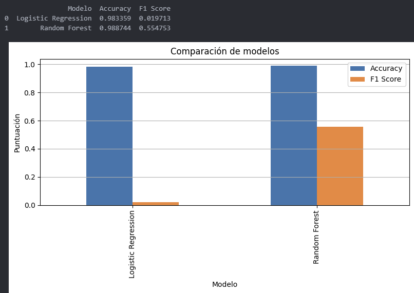

> La curva ROC muestra una excelente capacidad de discriminación (AUC ≈ 0.99). Esto confirma que el modelo es fuerte, aunque el threshold predeterminado no sea el ideal para nuestro caso.

---

### 🧩 Slide — Análisis de métricas por threshold

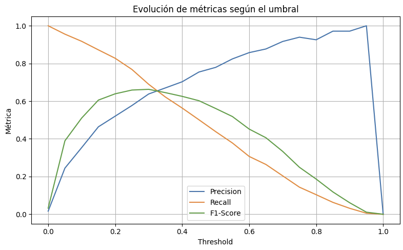

> Se evaluaron Precision, Recall y F1-score para distintos valores de threshold. Se observa que el mejor compromiso entre ambas métricas se encuentra alrededor de `0.3`.

---

### 🧩 Slide — Evaluación final con threshold = 0.3


> Usando un threshold de 0.3 se mejora significativamente el **recall** (sensibilidad) para la clase `rain = 1`, manteniendo un **F1-score de 0.66** y una precisión general del 99%. Esta decisión permite que el modelo sea más útil para fines predictivos reales.

---

---

### 🧩 Slide — Predicción final con nuevo dato


> Se ha creado una función `predict_new()` que recibe un diccionario con datos meteorológicos reales y devuelve:
>
> - La predicción (`rain = 0` o `1`)
> - La probabilidad asociada
>
> En el ejemplo mostrado, para el día 14 de febrero de 2025 a las 15:00, con 85% de humedad, presión de 1012.5 hPa, viento de 7.2 km/h y temperatura de 11.3 °C, el modelo predice que **sí va a llover**, con una probabilidad de lluvia del **72.85%**.

---

> 📌 Esta funcionalidad representa la **aplicación práctica del modelo**, y demuestra cómo puede integrarse en un sistema de predicción meteorológica, dashboard o alerta temprana.

---

## ✅ Conclusión

Este proyecto ha demostrado la viabilidad de predecir eventos de lluvia en Bilbao a partir de datos meteorológicos horarios reales, utilizando técnicas de Machine Learning aplicadas paso a paso.

Se ha trabajado con un dataset real y complejo, que ha requerido limpieza, transformación e imputación de valores nulos. Se abordó el importante problema del desbalance de clases mediante un muestreo estratificado personalizado, y se evaluaron múltiples modelos de clasificación binaria.

El modelo final —Random Forest ajustado con un threshold personalizado de 0.3— ha alcanzado un equilibrio óptimo entre precisión y sensibilidad, logrando:

- AUC ≈ 0.99  
- F1-score para lluvia ≈ 0.66  
- Recall ≈ 0.70 para `rain = 1`

Además, se implementó un sistema de predicción práctico sobre nuevos datos, abriendo la puerta a aplicaciones como sistemas de alerta temprana, dashboards o asistentes meteorológicos inteligentes.

📌 Este proyecto representa una solución sólida, reproducible y extensible para tareas de predicción meteorológica local, con una base metodológica rigurosa y clara interpretación de resultados.

---

## 🌐 Fuente de los datos

Los datos meteorológicos utilizados en este proyecto fueron extraídos de la plataforma [Meteostat](https://meteostat.net).  
Se descargaron mediante su API desde la estación de **Bilbao / Sondica** con resolución horaria entre **2000 y 2024**.

> Puedes acceder al portal y explorar los datos históricos directamente desde aquí:  
👉 [https://meteostat.net](https://meteostat.net)

---


### Desarrollado por **Alex Moura**  

📧 alex_gomes10@hotmail.com  
🌍 [GitHub: MouraAnalyst](https://github.com/MouraAnalyst)  
🌐 [LinkedIn: Alex Moura](https://www.linkedin.com/in/alex-moura-analyst/)
 

---
